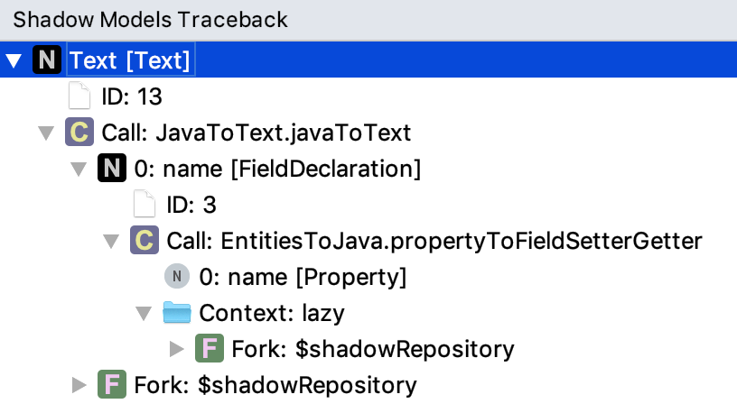

# Shadow Models
A shadow model is a non-editable model derived from existing models by model-to-model transformations.
It is incrementally maintained while editing the input model.

Transformations are described in a special language designed to support incremental updates of the output model.
Dynamic dependency tracking is used during the executing of the transformations
which removes the need for a declarative language.
BaseLanguage expressions with all its extensions are supported inside the transformation rules.

## Download
Download the nightly build of the plugins from the [release page](https://github.com/JetBrains/MPS-extensions/releases).

## Examples
There is a separate **Shadow Models (Examples)** plugin that contains some example languages and transformation
implementations to show you how to build your own shadow models.
The languages and input models can be found in the namespace **de.q60.mps.shadowmodels.examples**.
The transformations are implemented in the *transformation* aspect.

## Transformations

The transformation language is similar to the MPS generator language.
It has transformation rules with a left side that describes the input it applies to and a
right side that creates the output.

The right side is similar to
[light quotations](https://confluence.jetbrains.com/display/MPSD20183/Quotations#Quotations-Lightquotations%28quotationbuilders%29)
instead of using the concrete syntax of the target language.

## Repository Meta Model

When you implement transformations there is an important difference when working with modules and models.
In the world of shadow models there is only one root node concept `Repository`.
Modules and models are descendants of this single root node.
What in MPS is a root node is here just a child of a node of concept `Model`.
When you ask a root node for its parent you will get the `Model` node.

This has the advantage that you can define transformations on modules and models in the same way as on any other node.
You can query them using the more convenient smodel language instead of the Java API.

You have to keep in mind that asking a node for its root node will always return the repository.
If you need to know the model of a node you have to write `node.ancestor<Model>` instead.
`node.getModel()` will always return null.

You can find the whole meta model in the language `de.q60.mps.shadowmodels.runtimelang`.
Here is a summary of it:

```
Repository
  modules: Module[0..n]
  
Module implements INamedConcept
  id: string
  models: Model[0..n]
  
Model implements INamedConcept
  rootNodes: BaseConcept[0..n]
```

## Shadow Repository

You can make the output of your transformations appear in the project explorer as shown in the image below.


By default this is disabled.
You can activate it by choosing **Tools > Activate Shadow Repository** in the main menu.

To add your own output you have to define a transformation that contributes to the predefined transformation
**ShadowRepository.Repository** in the transformations aspect of the language *de.q60.mps.shadowmodels.repository*.

Here is an example that you can find in the language *de.q60.mps.shadowmodels.examples.statemachine*:
```
transformation t1 contributes to ShadowRepository.Repository (i0: Repository)
-> o0: Repository {
         modules: Module {
           name: "examples.statemachines" 
           models: map _.modules.models.where(...) -> call outputModel _  
         } 
       }
```

It is important to know that the whole shadow repository is executed inside a fork.
This will make sure that references are updated to point to nodes inside the shadow repository.
You can of course create additional sub forks.

## Forks

Shadow models allows you to write transformations in two different styles.
You can write them like functions and call everything explicitly or you can use forks.
Forks basically allow you to write transformation similar to how you would do it in the MPS generator.

In MPS the *unit of transformation* is a model.
You cannot generate a single class (in case of baseLanguage code) inside a model
and you cannot generate classes from different models together.
Shadow model forks can have any node as the **root** of the fork.
If you decide to make a model the root of your fork, then you have the equivalent to MPS.
But often the single root nodes inside the model are a better choice for the fork root.
In case of baseLanguage classes there is no difference if two classes
are in the same or in different models.

Forks also have support for **mapping labels** as you know them from MPS.
They can only work if the map is filled before mappings are queried from them.
Forks execute all transformations (which fills the map) before any reference is resolved (which queries mapping).
As in MPS where mapping labels only work inside the same model, here they only work inside the same fork.

Luckily, both have a solution for that.
MPS introduced [cross model generation](https://confluence.jetbrains.com/display/MPSD20183/Generator#Generator-Cross-modelgeneration)
where you define special checkpoints inside the generation plan.
In shadow models you can define **fork dependencies**.
If a transformation or mapping cannot be found in the same fork,
they are searched in all forks that are defined as a dependency.
You can add dependencies in the upper part of any transformation that is part of the fork.

As all transformations, forks are executed on demand.
You don't have to take care of generating your *models* in the correct order.
If you define a fork dependency, the transformation engine will make sure that the target fork exists when it's needed.

A fork can specify a list of transformations that are **automatically applied** to the input,
just like reduction rules in MPS.
By default there is only one attempt to apply transformations on all nodes that you copy using the `transform` keyword.
If there are nodes in the output where one of the transformations would again be applicable, nothing will happen unless 
you enable the **fixpoint** mode.
Then the fork is applied again on the output of the previous execution.
For performance reasons a fork is by default not in fixpoint mode.

The **identity** of a fork is composed of the fork name and the parameter values of the fork call.
You can use this to create multiple copies of the same input node.
Just add an additional (string) parameter to the fork and use a different value for each copy.
The fork identity is part of the node identity of all its output nodes.

## Reference Resolution

### Differences for Forks

All transformations inside a fork are executed before any reference resolution happens.
You will get an exception when the reference target was not created in this first phase.
If you are not inside a fork, there aren't these two phases.
Transformations are executed independent of if you access it through a parent-child relation or a reference.
You won't get an exception in this.

### Identity of a Node
A node in the output is identified by the transformation name and the parameter values of the transformation call. 
If you call a fork then the identity of the fork (fork name + parameter values) will be part of all it's output nodes.

For references it's often enough to specify the transformation call that creates the target.
It will then be resolved in the same fork, its dependencies or the parent fork.
If you need to, you can also specify the exact fork of the reference target. 

### References to Non-Shadow Nodes
If you want to generate code against an existing runtime library,
you can just write a baseLanguage expression that returns an `SNode` or `SNodeReference`
to set a reference to a fixed target.
No resolution will happen in this case.

In the *statemachines* example you can find the following transformation:
```
transformation enumConst overrides ... [i0: INamedConcept]
-> o0: EnumConstantDeclaration {
         name: _.name
         constructor -> *[node-ptr/Object->Object/]
       }
```
The constructor reference is pointing to the constructor of the Object class in the JDK stub models.

## Traceback

For debugging the output in the shadow repository you show the transformations that produced a given output node.
Right click on an output node and choose **Language Debug > Shadow Models: Traceback** from the context menu.

