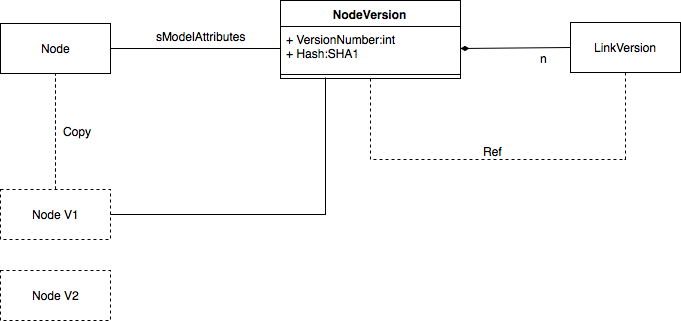

# Node Versioning
**Language Namespace :** `de.itemis.mps.nodeversioning`

The node versioning extension gives support for storing different *states/versions* of a node inside of the model. It is **not** a replacement for version control systems like `git`.

An example use case might be a model is used to describe an API and the users wants to detect changes between different releases of the API. This API has a version number that follows semVer associated with it. Now when users wants check what changes happened since the last release the information stored by this extension can be used to diff the current state against the last released one.

The scope of this extension is to provide a way to store the versions of a node and do change detection. It does intentionally not provide ways how to semantically reason about a change as this is highly domain specific. It might be used in conjunction with the `nodecomparator` to do structural diffs between versions.

State: *Incubating* 

This extension is currently incubating and might under go substantial changes in the future. Currently it only supports storing of the version information and change detection. For future feature ideas see the [potential features](#potential-features) section.

### What is a *Node* 
When we speak of a node in this document we mean the node and **all** of its children but not of the referenced nodes. Sometimes this is also called *subtree*.

When we speak of the *dependencies* of a node we mean all nodes that are referenced by either node itself or it children. 
## Meta Model

 The version information is stored on the node that is versioned as a `NodeAttribute` called `NodeVersion`. The `NodeVersion` contains a copy of the node at point in time when the version was created. In addition to the copy it also stores a *VersionNumber* which is a simple integer incremented with each version that is created. The *VersionNumber* has no other semantics than to provide ordering to the versions. To be able to detect changes of a node it also stores a hash of the node. The `NodeVersion` also contains a list of all the dependencies (reference targets) of the node and its version, these are called `LinkVersion`. 

## Change Detection 
On first glance change detection looks pretty straight forward. A node has changed when either the node itself has changed or one of the dependencies:

But if we at MPS models they are not simple tree but graphs that allow reference cycles. In this cases we cannot simply traverse the complete graph over the edges since we would end up in a cycle. Imagine model like this:

In this case the change detection has to take into account that there is a cycle from `5 --> 4 --> 6 --> 5`. The change detection algorithm detects this cycle and handles them appropriately. If none of the participants in a cycle have local changes then the whole cycle is assumed to be unchanged.

Technically the detection if a node has changed since the last time it has been versioned is done via hashing. If the hash differs from the hash calculated for the last version then the node has changed. The current implementation uses SHA 1 hashes to verify if the node has changed. 

## Potential Features
- *time travel*: Getting the model back into the exact same state as it was when a specific version on a node was created. Most likely as some kind of *transient* model that is not visible to the user. 
- Referencing nodes in a specific version. While this to some degree already happens behind the scenes. It might be useful for the user to implement an API in specific version.
- Delete handling. At the moment when the user deletes a node that is still referenced from some other node in an older version (that is potentially not visible to the user) the model is in a broken state.

## Usage
The general pattern that all functionally of the `nodeversioning` extension that all parts follow is that it will **never** mutate the model during its execution. It will collect changes or calculate a new set of `NodeVersions` but its up to the user of the extension to actually mutate the model. This behaviour is due to the fact that the domain requires human interaction to review the changes and allow to veto based on that review. 

First of all models that should get versioned need to use the `de.itemis.mps.nodeversioning` language. Most probably you want to expose this to the end user through a DevKit. This language does not add anything the user can see or interact with but adds the `NodeAttribute`s required for the versioning.

In order to version a model or otherwise interact with the versions stored in the nodes use the `de.itemis.mps.nodeversioning.runtime` solution. The class you want to have a look at is `VersioningHelper` it provides the methods to version a node or check if something has changed. For more details see the JavaDoc on that class.